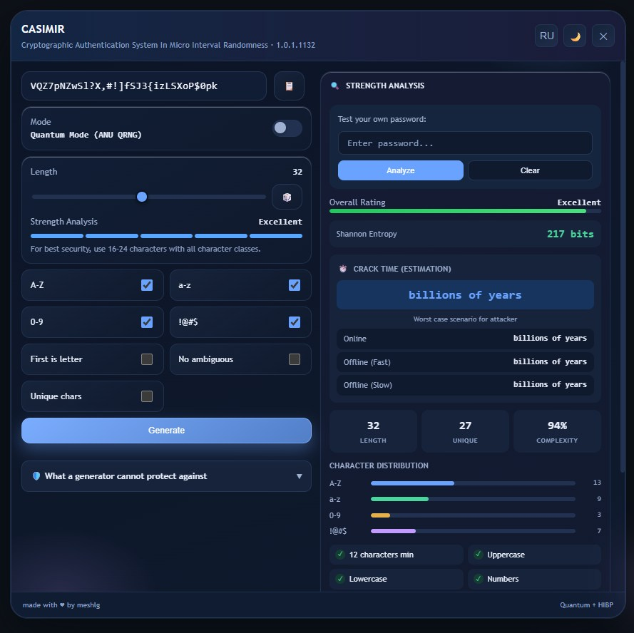

# CASIMIR

**Cryptographic Authentication System In Micro Interval Randomness**

[Русский](README-ru.md) | [English](README.md)

  
  
  
  
  
   
  
  
  

<em>Профессиональный генератор паролей с квантовой энтропией, расширенным анализом и проверкой утечек HIBP.</em>

  <a href="#быстрый-старт"><kbd>Быстрый старт</kbd></a>
  <a href="#возможности"><kbd>Возможности</kbd></a>
  <a href="#безопасность"><kbd>Безопасность</kbd></a>
  <a href="#установка"><kbd>Установка</kbd></a>

  Квантовая энтропия | Анализ в реальном времени | Интеграция HIBP | Двуязычный интерфейс

---

## О проекте

**CASIMIR** — это профессиональный генератор паролей (userscript), созданный для обеспечения максимальной безопасности и истинной случайности. Он использует квантовую механику (ANU QRNG) для создания непредсказуемых последовательностей, обходя ограничения стандартных программных генераторов псевдослучайных чисел.

### Ключевые преимущества

| Преимущество | Описание |
|--------------|----------|
| **Квантовая энтропия** | Истинно случайные числа из квантовых флуктуаций вакуума через API ANU QRNG |
| **Идеальное распределение** | Метод Rejection Sampling устраняет смещение по модулю |
| **Анализ в реальном времени** | Энтропия Шеннона, время взлома на GPU, детекция паттернов |
| **Интеграция с HIBP** | Протокол k-Anonymity проверяет пароли без их раскрытия |
| **Двуязычный интерфейс** | Полная локализация на английский и русский языки |
| **Две темы** | Светлая и тёмная темы с плавными переходами |

### Для кого это

- **Энтузиасты безопасности** — генерация криптографически стойких паролей
- **Разработчики** — тестирование стойкости паролей и проверка утечек
- **Приватность** — локальная генерация без сбора данных
- **Обычные пользователи** — повседневное создание паролей профессионального качества

---

## Быстрый старт

> [!IMPORTANT]
> Требуется менеджер пользовательских скриптов: [Tampermonkey](https://www.tampermonkey.net/) (рекомендуется) или [Greasemonkey](https://www.greasespot.net/) для Firefox.

### Установка

1. Установите расширение для пользовательских скриптов в свой браузер - 
2. Нажмите кнопку **Raw** на файле `CASIMIR.js` в этом репозитории
3. Браузер предложит установить скрипт
4. Нажмите `Alt + C` на любой веб-странице, чтобы открыть генератор
5. Или найдите иконку CASIMIR в правом нижнем углу

---

## Возможности

### Генерация паролей

| Возможность | Описание |
|-------------|----------|
| **Квантовая энтропия** | Опциональные истинно случайные числа через API ANU QRNG |
| **Настраиваемая длина** | Изменяемая длина пароля |
| **Наборы символов** | Прописные, строчные, цифры, символы |
| **Начинать с буквы** | Первый символ всегда A-Z или a-z |
| **Без похожих** | Исключить неоднозначные символы (i, l, 1, O, 0 и др.) |
| **Уникальные символы** | Без повторений символов в пароле |

### Анализ в реальном времени

- **Энтропия Шеннона** — стойкость пароля в битах
- **Время взлома на GPU** — примерное время взлома на современном оборудовании
- **Детекция паттернов** — последовательности, leetspeak, словарные слова
- **Оценка сложности** — процентный рейтинг с визуальной обратной связью

### Интеграция с HIBP

- Локальное хэширование SHA-1 с протоколом k-Anonymity
- На API отправляются только первые 5 символов хэша
- Проверка по миллиардам утёкших паролей
- Полный пароль никогда не передаётся

### Пользовательский интерфейс

- **Две темы** — Светлая и тёмная темы
- **Адаптивный макет** — Работает на всех размерах экрана
- **Горячие клавиши** — `Alt + C` для быстрого доступа
- **Переключение языка** — Кнопка EN/RU в заголовке
- **Визуальная обратная связь** — Анимации для индикации стойкости пароля

---

## Безопасность

> [!WARNING]
> CASIMIR работает полностью в вашем браузере. Ваши пароли никогда не отправляются никуда, кроме проверки k-Anonymity (первые 5 символов хэша).

### Принципы безопасности

| Принцип | Реализация |
|---------|------------|
| **Без сбора данных** | Пароли никогда не покидают ваш браузер |
| **k-Анонимность** | На HIBP отправляются только первые 5 символов SHA-1 хэша |
| **Локальное хранилище** | Настройки сохраняются локально в браузере |
| **Без сетевых запросов** | Квантовые случайные числа опциональны |
| **Защита от IFrame** | Скрипт работает только в главном окне |

### От чего CASIMIR НЕ защищает

| Угроза | Рекомендация |
|--------|--------------|
| **Фишинг** | Всегда проверяйте URL сайтов |
| **Кейлоггеры** | Используйте аппаратные ключи безопасности |
| **Перехват Cookie** | Включайте 2FA везде |
| **Социальная инженерия** | Будьте бдительны |

---

## Установка

### Требования

- [Tampermonkey](https://www.tampermonkey.net/) (рекомендуется) или
- [Greasemonkey](https://www.greasespot.net/) для Firefox

### Шаги

1. Установите расширение для пользовательских скриптов в свой браузер
2. Нажмите кнопку **Raw** на файле `CASIMIR.js` в этом репозитории
3. Браузер предложит установить скрипт
4. Нажмите `Alt + C` на любой веб-странице, чтобы открыть генератор
5. Или найдите иконку CASIMIR в правом нижнем углу

---

## Использование

### Генерация пароля

1. Нажмите `Alt + C` или кликните на плавающую иконку
2. Настройте параметры пароля (длина, символы, опции)
3. Нажмите **Сгенерировать**
4. Скопируйте пароль кнопкой копирования

### Анализ пароля

1. Введите любой пароль в поле анализа
2. Смотрите метрики в реальном времени:
   - Энтропия Шеннона (биты)
   - Примерное время взлома (на основе GPU)
   - Результаты детекции паттернов
   - Статус проверки утечек HIBP

### Смена языка

Нажмите кнопку переключения языка (EN/RU) в заголовке, чтобы переключиться между английским и русским.

---

## Технологии

- **JavaScript (ES6+)** — Основной функционал
- **Web Crypto API** — Хэширование SHA-1 для HIBP
- **ANU QRNG API** — Генерация квантовых случайных чисел
- **Have I Been Pwned API** — Проверка утечек
- **CSS3** — Современная стилизация с анимациями

---

## FAQ

### Как работает квантовая энтропия?

CASIMIR опционально запрашивает истинно случайные числа из API Quantum Random Number Generator (QRNG) Австралийского национального университета. Эти числа получены из измерений квантовых флуктуаций вакуума, обеспечивая истинную непредсказуемость.

### Безопасно ли использовать проверку HIBP?

Да. CASIMIR использует протокол k-Anonymity: на API отправляются только первые 5 символов SHA-1 хэша вашего пароля. Полный пароль никогда не покидает ваш браузер.

### Зачем использовать Rejection Sampling?

Стандартный выбор случайных чисел по модулю вносит смещение. Rejection Sampling гарантирует, что каждый символ имеет абсолютно равную вероятность выбора.

### Можно ли использовать офлайн?

Да. Квантовая энтропия опциональна. Без неё CASIMIR использует встроенный в браузер crypto.getRandomValues(), который также криптографически стоек.

### Как сообщить об ошибке?

Откройте issue на [GitHub Issues](https://github.com/meshlg/CASIMIR/issues/new/choose).

---

## Журнал изменений

См. [CHANGELOG.md](CHANGELOG.md) для истории версий.

---

## Лицензия

MIT License. Подробности см. в файле [LICENSE](LICENSE).

---

**[MIT License](LICENSE)** | 2026 c meshlg  
[Сообщить о проблеме](https://github.com/meshlg/CASIMIR/issues/new/choose) | [Поставить звезду](https://github.com/meshlg/CASIMIR/stargazers)

